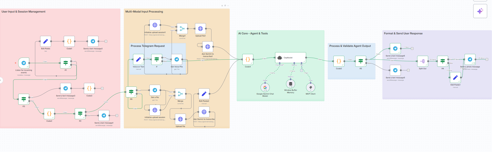

# Cepassist - MCP Market Fiyatı Asistanı
Bu proje, Model Context Protocol (MCP) mimarisini temel alan gelişmiş bir yapay zeka asistanıdır. Asistan, marketfiyati.org.tr sitesinin iç API'lerini kullanarak, Türkiye'deki zincir marketlerden canlı ve anlık ürün fiyat verilerini çeker.Projenin temelindeki en önemli teknoloji, LLM'in (Google Gemini) doğrudan Model Context Protocol'ü kullanarak bizim Python projemizdeki fonksiyonlara (find_shopping_list_prices gibi) erişmesidir. Bu sayede yapay zeka, sadece bir sohbet botu olmaktan çıkıp, gerçek dünyadaki veriye ulaşabilen ve görevleri yerine getirebilen bir "ajan" haline gelir.

[Türkçe](#türkçe) | [English](#english)

---

<a name="türkçe"></a>
##  Türkçe Açıklama

<details>
<summary>Detayları görmek için tıklayın</summary>

### 🤖 Örnek Kullanım / Demo


### 🚀 Proje Hakkında

Bu sistem, kullanıcıların Telegram üzerinden metin, ses veya ürün fotoğrafı ile sordukları soruları anlar. Ardından, Model Context Protocol (MCP) aracılığıyla, yerel makinede çalışan Python sunucusundaki fonksiyonları tetikler. Bu fonksiyonlar, marketfiyati.org.tr sitesinin iç API'lerine canlı istekler atarak, kullanıcının konumuna en yakın marketlerdeki anlık fiyat ve ürün bilgilerini alır. Sonuçlar, n8n iş akışı tarafından zenginleştirilerek (resimler, akıllı bilgilendirme mesajları vb.) kullanıcıya sunulur.

Önemli Not: Bu proje, marketfiyati.org.tr sitesinin resmi ve belgelenmiş bir genel API'sini değil, sitenin kendi tarayıcılar için kullandığı iç API'leri kullanmaktadır. Proje, tamamen iyi niyetli, eğitim ve hobi amaçlı geliştirilmiştir. Lütfen sorumlu bir şekilde kullanın ve siteye aşırı yük bindirecek otomatik isteklerden kaçının.

### 🏛️ Mimarî Şeması



### ✨ Temel Özellikler

* **Model Context Protocol (MCP) Mimarisi:** Projenin kalbinde, yapay zeka modelinin (LLM) harici fonksiyonları güvenli ve standart bir şekilde çağırmasını sağlayan MCP mimarisi yer alır.

* **Canlı Veri:** Bot, statik bir veritabanı kullanmaz. Her sorgu, anlık ve güncel fiyatları almak için hedeflenen siteye canlı API isteği yapar.

* **Çoklu-Modlu Sorgulama (Metin, Ses, Resim):** Metin, ses veya ürün fotoğrafı ile sorgu yapma imkanı.

* **🧠 Konum Hafızası ve Yönetimi:** Asistan, her kullanıcı için paylaşılan son konumu hatırlar ve sonraki sorgularda bu konumu otomatik olarak kullanır. Kullanıcılar **`/yenikonum`** komutunu göndererek bu hafızayı diledikleri zaman kolayca sıfırlayabilir.

* **Akıllı Yanıt Formatlama:** Bot, bulduğu ürünler için önce bir özet mesajı gönderir, ardından her bir ürünü kendi resmi, fiyatı, marketi ve mesafesiyle birlikte ayrı ayrı, şık bir formatta sunar.

* **Koşullu Mantık ve Hata Yönetimi:** Konum yoksa uyarma, ürün bulunamazsa bilgilendirme, geçersiz resim URL'leri için temsili bir logo gösterme gibi gelişmiş mantıklara sahiptir.

* **Güvenli API:** Bearer Token (JWT) doğrulaması ile Python sunucusuna sadece yetkili istemcilerin (n8n gibi) erişmesi sağlanır.


### 🛠️ Kullanılan Teknolojiler

* **Backend:** Python 3.10+

* **AI Modelleri:** Google Gemini 2.5 Flash

* **AI Mimarisi:** Model Context Protocol (MCP)

* **API & Sunucu:** FastMCP, Flask, Uvicorn, Click

* **Veri Doğrulama:** Pydantic

* **Tünelleme:** Ngrok

* **Otomasyon ve Beyin:** n8n

* **Arayüz:** Telegram

### 📂 Proje Yapısı

```
.
├── .env.example          # .env dosyası için doldurulması gereken şablon
├── client.py             # marketfiyati.org.tr API istemcisi
├── dashboard.py          # Güvenlik token'ı üreten web paneli
├── market_fiyati_mcp_server.py # Ana Python MCP sunucusu
├── models.py             # Pydantic veri modelleri
└── CepAssist_Workflow.json # n8n için hazır iş akışı dosyası

```


### 🏁 Kurulum ve Kullanım

#### Adım 1: Projeyi ve Bağımlılıkları Kurma
```bash

git clone https://github.com/FatihSuicmez/Market_Fiyati_MCP.git
cd Market_Fiyati_MCP
pip install -r requirements.txt
```

#### Adım 2: .env Dosyasını Yapılandırma 

Projenin çalışması için gerekli olan API anahtarları gibi gizli bilgileri bu adımda ayarlayacağız.

Proje ana klasöründe bulunan .env.example dosyasını bulun. Bu dosya, gerekli olan tüm ayarlar için bir şablondur.

Bu dosyanın bir kopyasını oluşturun ve kopyanın adını .env olarak değiştirin.

Yeni oluşturduğunuz .env dosyasını bir metin editörü ile açın.

Dosyanın içindeki ilgili alanları kendi kişisel anahtarlarınız (Telegram Bot Token, Google Gemini API Key vb.) ile doldurun.

Bu .env dosyası, .gitignore içinde listelendiği için asla Git reponuza gönderilmez, böylece sırlar güvende kalır.

#### Adım 3: Gerekli Araçları ve Anahtarları Hazırlama

1.  **Telegram Bot Token:** Telegram'da **`@BotFather`** ile konuşarak **`/newbot`** komutuyla yeni bir bot oluşturun ve size verdiği **token'ı** kaydedin.
2.  **Google Gemini API Anahtarı:** [Google AI Studio](https://aistudio.google.com/app/apikey)'dan bir API anahtarı oluşturun ve kaydedin.
3.  **Ngrok (Zorunlu Araç):** n8n'in yerel makinenizde çalışan `market_fiyati_mcp_server.py` sunucusuna ulaşabilmesi için `ngrok`'a ihtiyacımız var. [Ngrok indirme sayfasından](https://ngrok.com/download) sisteminize uygun `ngrok` uygulamasını indirin ve proje klasörünüze yerleştirin.

#### Adım 4: n8n'i Yapılandırma

* **Adım 4a: Kimlik Bilgilerini (Credentials) Ekleme**
        n8n'de "Credentials" bölümüne gidin ve şu üçünü oluşturun:
        1.  `Telegram Bot API`: BotFather'dan aldığınız token.
        2.  `Google Gemini`: Google'dan aldığınız API anahtarı.
        3.  `Bearer Auth`: `http://127.0.0.1:8050` adresine giderek oluşturduğunuz token.
    * **Adım 4b: İş Akışını İçe Aktarma ve Ayarlama**
        1.  Projedeki **`CepAssist_Workflow.json`** dosyasını n8n'e aktarın.İçe aktaracağınız iş akışı aşağıdaki gibi görünecektir:
           
        3.  Akıştaki **`MCP Client`** noduna tıklayın. Ayarlarını aşağıdaki gibi yapın:
            * **Credential for Bearer Auth:** Açılır menüden daha önce oluşturduğunuz `Bearer Auth` kimlik bilgisini seçin.
            * **Endpoint URL:** Bu alana, Ngrok terminalinde size verilen `https://...ngrok-free.app` adresini **sonuna `/sse` ekleyerek** yapıştırın. *Örnek: `https://b1a2-c3d4-e5f6.ngrok-free.app/sse`*
        4.  Akıştaki diğer nodlara (`Telegram Trigger`, `Google Gemini`) tıklayarak ilgili kimlik bilgilerini seçtiğinizden emin olun.


#### Adım 5: Sistemi Çalıştırma ve Kullanma

**Arka Planı ve Tüneli Çalıştırın (3 Ayrı Terminalde):**

* **1. Terminal (Güvenlik Sunucusu):** python dashboard.py

* **2. Terminal (Ana MCP Sunucusu):** python market_fiyati_mcp_server.py

* **3. Terminal (Ngrok Tüneli):** ./ngrok.exe http 8071 (ve https://... adresini kopyalayın).


* **n8n'i Son Kez Ayarlayın:**

n8n akışındaki MCP Client noduna tıklayın.

* **Endpoint URL:** Ngrok'tan kopyaladığınız adresi sonuna /sse ekleyerek yapıştırın.

* **Authentication:** dashboard.py'nin arayüzünden (http://127.0.0.1:8050) oluşturduğunuz Bearer Token için bir kimlik bilgisi oluşturup seçin.

* **Test Edin:** n8n akışını aktif hale getirin ve Telegram botunuzla konuşmaya başlayın!

</details>

---

<a name="english"></a>
## English Description

<details>
<summary>Click to see details</summary>

### 🤖 Example Usage / Demo


### 🚀 About The Project

This system understands questions asked by users via Telegram through text, voice, or a photo of a product. Then, using the Model Context Protocol (MCP), it triggers functions on a Python server running on a local machine. These functions send live requests to the internal APIs of marketfiyati.org.tr to fetch real-time price and product information from the nearest supermarkets based on the user's location. The results are enriched by the n8n workflow (with images, smart informational messages, etc.) and presented to the user.

Important Note: This project uses the internal APIs of the marketfiyati.org.tr website, which are used by the site's own browser, not an official, documented public API. The project has been developed in good faith for educational and hobbyist purposes. Please use it responsibly and avoid making requests that could overload the site.

### 🏛️ Architecture Diagram



### ✨ Core Features

* **Model Context Protocol (MCP) Architecture:** At the heart of the project is the MCP architecture, which allows the AI model (LLM) to call external functions in a secure and standardized way.

* **Live Data:** The bot does not use a static database. Every query makes a live API request to the target site to get up-to-the-minute, current prices.

* **Multimodal Queries (Text, Voice, Image):** The ability to query with text, voice, or a photo of a product.

* **🧠 Location Memory & Management:** The assistant remembers the last shared location for each user and automatically uses this location in subsequent queries. Users can easily reset this memory at any time by sending the **`/yenikonum`** command.

* **Intelligent Response Formatting:** The bot first sends a summary message for the products it finds, then presents each product individually in an elegant format with its image, price, market, and distance.

* **Conditional Logic and Error Handling:** It has advanced logic, such as warning the user if a location is missing, informing them if a product is not found, and displaying a representative logo for invalid image URLs.

* **Secure API:** Bearer Token (JWT) authentication ensures that only authorized clients (like n8n) can access the Python server.


### 🛠️ Tech Stack

* **Backend:** Python 3.10+

* **AI Models:** Google Gemini 2.5 Flash

* **AI Architecture** Model Context Protocol (MCP)

* **API & Server:** FastMCP, Flask, Uvicorn, Click

* **Data Validation:** Pydantic

* **Tunneling:** Ngrok

* **Automation & Brain:** n8n

* **Interface:** Telegram

### 📂 Project Structure

```
.
├── .env.example          # A template for the required .env file
├── client.py             # The client that communicates with the marketfiyati.org.tr API
├── dashboard.py          # A web panel that generates security tokens
├── market_fiyati_mcp_server.py # The main Python MCP server
├── models.py             # Pydantic data models
└── CepAssist_Workflow.json # The ready-to-use workflow file for n8n

```


### 🏁 Setup and Usage

#### Step 1: Clone Project & Install Dependencies
```bash

git clone https://github.com/FatihSuicmez/Market_Fiyati_MCP.git
cd Market_Fiyati_MCP
pip install -r requirements.txt
```

#### Step 2: Configure the .env File

In this step, we will set up the secret information, such as API keys, required for the project to run.

Find the .env.example file in the main project folder. This file is a template for all the necessary settings.

Create a copy of this file and rename the copy to .env.

Open the newly created .env file with a text editor.

Fill in the respective fields with your own personal keys (Telegram Bot Token, Google Gemini API Key, etc.).

This .env file will never be sent to your Git repository because it is listed in .gitignore, so your secrets remain safe.

#### Step 3: Prepare Required Tools & Keys

1.  **Telegram Bot Token:** Create a new bot by talking to **`@BotFather`** on Telegram with the **/newbot** command and save the **token** he gives you.
3.  **Google Gemini API Key:** Create an API key from [Google AI Studio](https://aistudio.google.com/app/apikey) and save it.
4.  **Ngrok (Required Tool):** We need ngrok so that n8n can reach the market_fiyati_mcp_server.py server running on your local machine. Download the appropriate ngrok application for your system from the [Ngrok download page](https://ngrok.com/download) and place it in your project folder.

#### Step 4: Configure n8n

* **Step 4a: Add Credentials**
        In n8n, go to the "Credentials" section and create the following three:
        1.  `Telegram Bot API`: The token you got from BotFather.
        2.  `Google Gemini`: The API key you got from Google.
        3.  `Bearer Auth`: The token you generate by going to http://127.0.0.1:8050.
    * **Step 4b: Import and Set Up the Workflow**
        1. Import the **`CepAssist_Workflow.json`** file from the project into n8n. The workflow you import will look like this:
           
        3.  Click on the **`MCP Client`** node in the workflow. Configure its settings as follows:
            * **Credential for Bearer Auth:** Select the Bearer Auth credential you created earlier from the dropdown menu.
            * **Endpoint URL:** Paste the https://...ngrok-free.app address given to you in the Ngrok terminal, **adding /sse to the end**. *Example: `https://b1a2-c3d4-e5f6.ngrok-free.app/sse`*
        5.  Click on the other relevant nodes in the workflow (`Telegram Trigger`, `Google Gemini`) and make sure you have selected your credentials.


#### Step 5: Run the System and Usage

**Run the Backend and Tunnel (in 3 Separate Terminals):**

* **1st Terminal (Security Server):** python dashboard.py

* **2nd Terminal (Main MCP Server):** python market_fiyati_mcp_server.py

* **3rd Terminal (Ngrok Tunnel):** ./ngrok.exe http 8071 (ve https://... adresini kopyalayın).


* **Final n8n Configuration:**

Click on the MCP Client node in the n8n workflow.

* **Endpoint URL:** Paste the address you copied from Ngrok, adding /sse to the end.

* **Authentication:** Create and select a new Bearer Auth credential using the token generated from the dashboard.py interface (http://127.0.0.1:8050).

* **Test:** Activate the n8n workflow and start talking to your Telegram bot!

</details>

---
